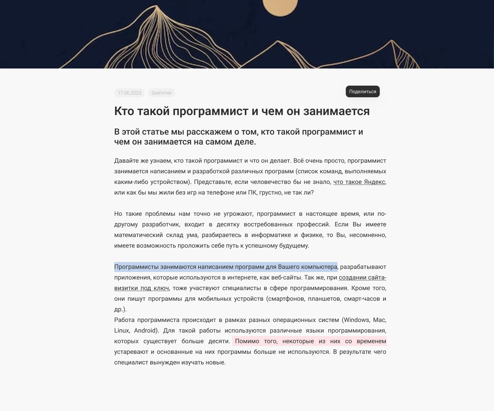

## <h1 align="center">Inkwell</h1>


### About us
Web service for creating and publishing anonymous articles

### Project setup

```bash
# Clone repository
git clone git@github.com:vnj64/service-for-publishing-articles.git

# Move to the root.
cd service-for-publishing-articles/

# Create docker container with PostgreSQL
docker run --name {container_name} -e POSTGRES_USER={postgres_user} -e POSTGRES_PASSWORD={postgres_password} -p {port}:5432 -d postgres

# Set environment variables on application.properties
spring.datasource.url=jdbc:postgresql://localhost:{port}/{postgres_user}
spring.datasource.username={postgres_user}
spring.datasource.password={postgres_password}

server.port=3030
server.address={your_address / or delete this string}

# Run the maven collector.
./mvnw spring-boot:run
or
run BookShopApplication from your IDE.
```

### API
```http request
GET http://212.193.62.200:8080/api/articles?id=HelloWorld-2023-10-21
```
```http request
POST http://212.193.62.200:8080/api/articles
```
The POST request has a request body in the format:
```json
{
    "title": "Кейс жесть от Вебпрактик (блог-платформа) test",
    "coverImage": "asdf",
    "name": "",
    "date": "2023-10-21",
    "body": "Хороший вопрос",
    "theme": "test"
}
```